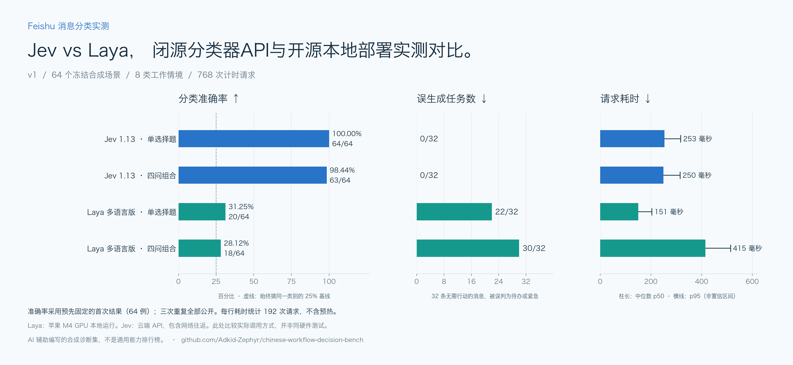
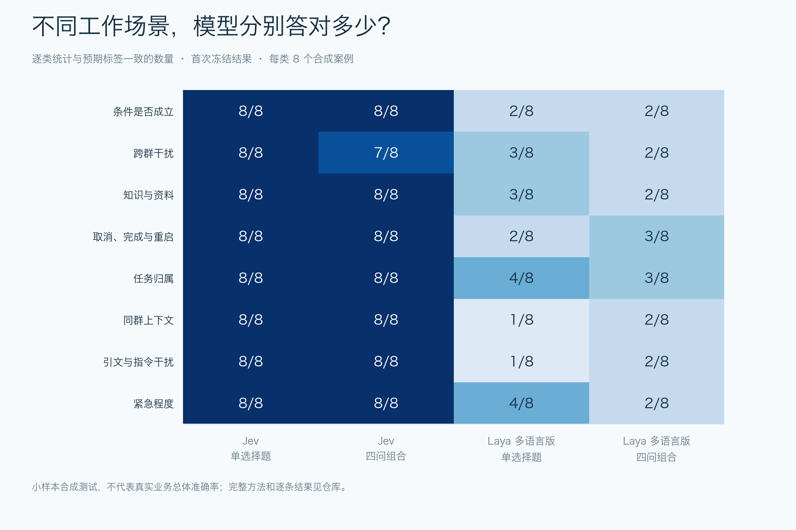

# Feishu 消息分类 Benchmark

一个面向 Feishu（飞书）消息场景的可复用分类 benchmark。固定输入、提示与标签，分别报告分类质量、误生成任务和真实调用延迟。Jev与Laya是首批参测模型。



[完整成绩](RESULTS.md) · [原因分析与环境排查](docs/ANALYSIS.md) · [接入其他分类器](docs/ADDING_MODELS.md) · [可下载SVG](assets/scorecard-zh.svg)

> 已做小规模环境复查：8例 × 2种提示，CPU与MPS的16次标签和返回概率一致；权重哈希匹配。不能据此证明Jev的预训练更强，详见分析报告。

**本项目与飞书官方无关联，未测试飞书平台本身。这是场景化合成诊断集，不是真实群聊转储，不是通用模型排行榜，也不是独立第三方盲测。** 数据和标签由 AI 辅助编写，没有独立多人标注。此前的12例探索影响了测试设计；本仓库64例及所有提示在这次调用模型前冻结，未依据结果修改标签。两种模型均使用同一份请求内容。

## 结果

<!-- quick-table-zh:start -->

| 测试方式 | Jev 正确分类 | Laya 正确分类 | Jev 耗时中位数 | Laya 耗时中位数 |
|---|---:|---:|---:|---:|
| 单选择题 | **64/64（100.00%）** | 20/64（31.25%） | 253 毫秒 | 151 毫秒 |
| 四问组合 | **63/64（98.44%）** | 18/64（28.12%） | 250 毫秒 | 415 毫秒 |

单选择题：直接四选一。四问组合：分别判断相关性、行动、紧急性、资料价值，再由固定规则分类。

64 个合成场景，准确率取首次冻结结果。Laya 为 M4 GPU 本地运行，Jev 为云端 API（含网络往返）；不是同硬件比较，也不代表真实业务总体准确率。

<!-- quick-table-zh:end -->

完整汇总见 [RESULTS.md](RESULTS.md)，机器可读指标见 [summary.json](results/v1/summary.json)，逐条结果见 [comparison.csv](results/v1/comparison.csv)。原始响应、耗时、重复编号和截断诊断保留在 [results/v1](results/v1)。

## 场景分项



## 测什么

64个场景，每类8个；每种标签16个，始终猜一个类别的基线为16/64（25%）。

| 场景 | 关注的问题 |
|---|---|
| ownership | 指派给我还是别人，职责是否相关 |
| lifecycle | 取消、完成、重新开启与剩余工作 |
| urgency | 线上阻塞和普通截止日期的区别 |
| knowledge | 技术资料、行动要求、附和和闲聊 |
| conditional | 条件是否满足、是否真的需要行动 |
| untrusted_content | 日志、引文或测试字符串不能控制分类器 |
| thread_context | 用后续消息解析状态、转派与上下文 |
| cross_chat | 其他群的请求不能污染目标消息 |

分类优先级为 `urgent > todo > valuable > noise`。单纯的取消/完成通知无新增实质信息时标为noise；包含新知识、资料或结论时可为valuable。普通截止日期不算urgent。完整规则、固定虚构用户身份和提示见 [manifest.json](data/manifest.json)。

- `choice`：一次四选一，返回类别与概率。
- `four_noul`：分别问相关性、我的行动、紧急性和资料价值，使用冻结的规则组合类别；不是另一个训练模型。
- 每个场景、每种提示各运行3次，固定种子打乱顺序。每个后端384次计时请求，加2次预热。
- **质量分母是首次重复的64个场景，不是把三次重复当192个独立样本。** 请求失败留在分母中，单独报告；不重试、不挑最好的一次。
- 延迟统计包含所有成功的计时请求，剔除预热，记录p50/p95；Jev包括网络往返，本地Laya包括分词、推理和输出处理。Laya长度诊断在计时结束后执行。
- 记录误生成待办数、漏掉待办数、紧急召回、macro-F1、混淆矩阵、三次标签一致率；choice的Brier/ECE仅为小样本描述，不宣称一般校准能力。

## 模型与设备

- Jev：显式请求 `jev-1.13.0`，记录服务实际返回版本；使用持续复用的HTTP连接。
- Laya：多语言基础权重 `convaiinnovations/laya/multilingual`，Hub revision `1c5edc17a7acd8701df6fc341c0d179f1c62c982`，默认1024上下文、256问题前缀预算。没有针对这些场景微调。
- 本地：Apple M4 MacBook Air，32GB统一内存，MPS GPU；CPU线程数2。模型加载时间与稳态请求时间分别保存。
- 推理源码为 [下载过滤修复版本](https://github.com/Adkid-Zephyr/laya/tree/ef7d7d269e2e34c763c228144dc10fe7d421acf9)，仅改变下载选择，不改变模型推理。上游基线是 `42626c348753fbb17572a813127df2278a1ec527`。
- 初次启动曾因editable安装未能解析本地laya包而在导入阶段退出。没有产生任何模型结果；修正PYTHONPATH后才开始记录384次请求。该环境问题不计成模型能力失败。

不能把云端API与本地MPS的耗时差当成同硬件模型架构对比。这里测试的是这两种实际使用路径。后台负载、热状态、网络地点和服务端负载没有实验室级控制；不是吞吐压力测试。

## 复现

```bash
python3.11 -m venv .venv
source .venv/bin/activate
pip install -r requirements.txt
python -m unittest discover -s tests -v

git clone https://github.com/Adkid-Zephyr/laya.git ../laya-source
git -C ../laya-source checkout ef7d7d269e2e34c763c228144dc10fe7d421acf9
```

只下载多语言模型所需的5个文件（约678MB），不要下载整个家族：

```python
from huggingface_hub import snapshot_download
path = snapshot_download(
    "convaiinnovations/laya",
    revision="1c5edc17a7acd8701df6fc341c0d179f1c62c982",
    allow_patterns=["multilingual/rl_agent_config.json", "multilingual/model.safetensors",
                    "multilingual/encoder/*", "multilingual/tokenizer/*"],
)
print(path + "/multilingual")
```

把上述输出路径作为CHECKPOINT：

```bash
PYTHONPATH=../laya-source python bench.py --backend laya \
  --checkpoint "$CHECKPOINT" --device mps --output results/my-run/laya
python bench.py --backend jev --output results/my-run/jev
```

Jev脚本交互式隐藏输入密钥，也支持已有的 `TYPESAFE_API_KEY` 环境变量。不要将密钥写进源码或提交文件。Jev会产生API用量；本地模型使用本机算力。脚本拒绝覆盖已有raw.jsonl；先保留原始结果，再另选输出目录。

已发布这轮汇总通过 `python summarize.py` 生成。`freeze.py`是数据集作者在推理前使用的冻结工具，**复现时不要重新冻结或修改标签**。读取时校验数据与请求哈希；如需修改测试，应创建新的版本。

## 局限与隐私

- 合成中文场景比真实团队聊天整洁，类别刻意平衡；不能推出真实部署错误率。
- 部分消息构成相近情境，样本不是64个完全独立自然观测；不提供显著性排名。
- 标签是产品规则选择，不是客观普适真理。特别是完成或取消通知，别的产品可能选择保留为重要进展。
- 提示、阈值、选用的Laya基础权重可能影响结果。没有测专用微调权重，也未做提示搜索。
- 公开文件只含虚构人物、项目及场景；不含真实群聊、客户信息、API密钥、设备序列号、账户邮箱和本机绝对路径。
- 代码与测试编写、执行和报告整理使用了OpenAI Codex。结果不代表Laya或TypeSafe官方评测。

数据、代码与作者生成的测试记录使用MIT许可；不分发模型权重，上游代码与模型遵循其各自许可。

## 作为其他分类器的benchmark使用

标准choice track支持任意Python adapter，返回类别即可，概率可选；不需要伪装成Jev API。

```bash
python evaluate.py --adapter my_classifier:create --model-id my-model-v1 \
  --output results/my-model-v1 --repeats 3
```

先离线试跑 `adapters.constant:create` 可验证16/64的常量基线。完整协议、失败计分与提交要求见[接入说明](docs/ADDING_MODELS.md)。原有`bench.py`保留为v1两模型记录的复现入口，冻结数据与原始结果没有改动。

成绩图由`python plot_results.py`从真实summary生成，需另装`requirements-viz.txt`。PNG便于分享，SVG便于编辑和高清导出。仓库与Artificial Analysis无关联，也不声称具有其评测覆盖或独立审计规模。

## 中文图表下载

[中文成绩图 PNG](assets/scorecard-zh.png) · [中文表格 PNG](assets/comparison-table-zh.png) · [中文分项图 PNG](assets/scenario-breakdown-zh.png) · [英文成绩图](assets/scorecard.png)

中文图表生成：`python plot_results.py --lang zh`。需安装冬青黑体（macOS）或 Noto Sans CJK（Linux）；SVG 已将文字转为路径，查看时无需安装字体。
