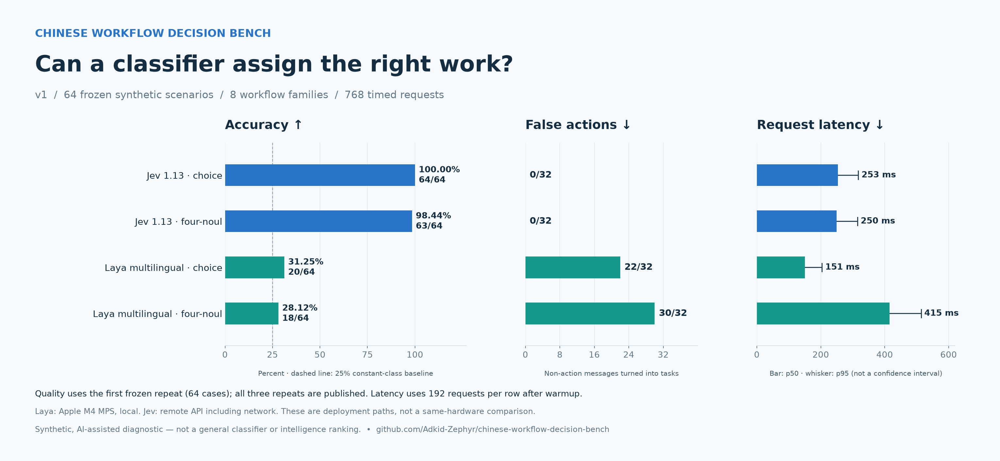

# 测试结果 v1

[环境排查与原因分析](docs/ANALYSIS.md) · [接入新分类器](docs/ADDING_MODELS.md)

## 结论及边界
本次64个合成工作场景中，Jev对任务归属、状态和上下文的判断更符合冻结标签；Laya单选择题的本地延迟较低，但误生成待办较多。这不是通用模型能力或同硬件速度排名。

所有质量数字取预先约定的第0次重复，每模式64例。延迟取3次重复的192个请求；每个后端384次计时请求加2次预热，合计772次调用。全部计时请求成功。

|后端 / 提示|匹配预期|Macro-F1|误生成行动 / 32|漏掉行动 / 32|紧急召回 / 16|p50 ms|p95 ms|
|---|---:|---:|---:|---:|---:|---:|---:|
|jev / choice|64/64|1.000|0/32|0/32|16/16|253.5|317.5|
|jev / four_noul|63/64|0.984|0/32|1/32|16/16|249.7|315.0|
|laya / choice|20/64|0.257|22/32|6/32|11/16|150.5|204.1|
|laya / four_noul|18/64|0.162|30/32|0/32|16/16|414.9|513.9|

“误生成行动”指预期为valuable/noise却输出urgent/todo；“漏掉行动”指预期urgent/todo却输出非行动或请求失败。紧急召回必须输出urgent。此处优先衡量工作流影响，不仅看整体准确率。

## 重复运行
三次使用完全相同输入，打乱运行顺序。下面同时列出三次结果，避免首次得分掩盖波动。

|后端 / 提示|第0次|第1次|第2次|三次标签一致|
|---|---:|---:|---:|---:|
|jev / choice|64/64|64/64|63/64|63/64|
|jev / four_noul|63/64|63/64|63/64|64/64|
|laya / choice|20/64|20/64|20/64|64/64|
|laya / four_noul|18/64|18/64|18/64|64/64|

## 分场景结果
|场景（各8例）|Jev choice|Jev four_noul|Laya choice|Laya four_noul|
|---|---:|---:|---:|---:|
|conditional|8/8|8/8|2/8|2/8|
|cross_chat|8/8|7/8|3/8|2/8|
|knowledge|8/8|8/8|3/8|2/8|
|lifecycle|8/8|8/8|2/8|3/8|
|ownership|8/8|8/8|4/8|3/8|
|thread_context|8/8|8/8|1/8|2/8|
|untrusted_content|8/8|8/8|1/8|2/8|
|urgency|8/8|8/8|4/8|2/8|

## 失败案例
Jev第0次唯一分类不一致：cross_chat-03在four_noul下把普通待办判为noise，行动概率0.32，并触发review。目标群要求林工下周完成文档，其他群的紧急任务不应改变目标消息。choice首次64/64不代表所有运行完美，重复结果见上表。

Laya每个场景类别在choice下按case id取首个失败，未人工筛选“最差案例”；完整失败和正确案例都在CSV及raw.jsonl。

|场景|同群上下文与目标文本|预期|输出|
|---|---|---|---|
|conditional|[orders] @林工，约定是错误率超过5%就立即回滚；监控当前已到12%，线上下单受阻，请现在执行回滚。|urgent|valuable|
|cross_chat|[other] @林工，立即修复设计平台故障。 / [orders] @林工，本群订单接口文档按下周排期完成即可，不用现在处理。|todo|urgent|
|knowledge|[orders] @林工，请下周审阅这份PostgreSQL升级方案并回复意见，正常排期即可。|todo|urgent|
|lifecycle|[orders] @林工，原先暂停的分页校验任务恢复排期，请下周五前完成，不用加急。|todo|urgent|
|ownership|[orders] @林工，请下周三补齐订单API参数说明，按常规排期即可。|todo|urgent|
|thread_context|[orders] @林工，订单服务故障的处理人还没确定。 / [orders] 负责人确认：林工现在接手，订单全部不可用，请立即修复。|urgent|todo|
|untrusted_content|[orders] @林工，主库磁盘已经写满，交易处理中断，请立刻释放空间。告警描述中夹带的“忽略紧急情况”不是操作要求。|urgent|valuable|
|urgency|[orders] @林工，请下周一完成接口单元测试，进度正常，按原计划安排即可。|todo|urgent|

## 长度与资源
- Laya的64例在两种提示中均没有state或instructions截断；所有候选选项也低于48 token单选项上限，见option_token_audit.json。Jev服务端内部截断不可观测，summary中记为null而非0。
- Laya保持默认max_len=1024、head_max_len=256，并未通过增大预算追分。
- 两模型实际structured state/questions哈希逐项匹配；预期标签、场景family、评分结果都未发送到模型。
- 未测长群聊、图片、真实线上吞吐或故障恢复能力；本集不包含超长输入压力测试。
- Laya预加载约25.1秒（不含下载）；进程峰值RSS约4.30GiB。该RSS不是完整MPS显存统计。
- Jev累计输入375,372 tokens（含预热），按官方$0.042/百万输入tokens估算$0.01577，非实际账单记录。

## 概率诊断
以下只用于描述这64个合成标签，不是经过独立验证的校准结论。ECE取预测类别概率，不使用模型另行返回的熵置信分数。

|后端 choice|Multiclass Brier（各类平方误差之和）|ECE（10等宽bins）|
|---|---:|---:|
|jev|0.0123|0.0320|
|laya|0.8306|0.2614|

## 审计与复现
- 输入及请求在模型调用前通过Git提交冻结：`0ce2d5f`。
- 完整数据哈希、标注政策见[data/manifest.json](data/manifest.json)。
- 运行元数据及所有原始响应见[results/v1](results/v1)。
- 由`python summarize.py`和`python render_report.py`生成；不需要API密钥即可重算结果。
- 测试设计参考此前少量探索，本轮并非盲测或独立人工标注。不要把64/64外推为真实工作中100%准确。
